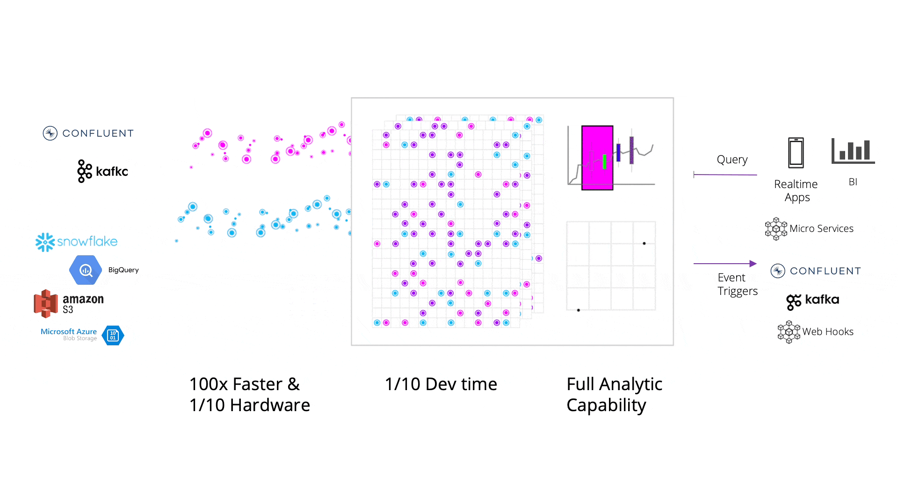
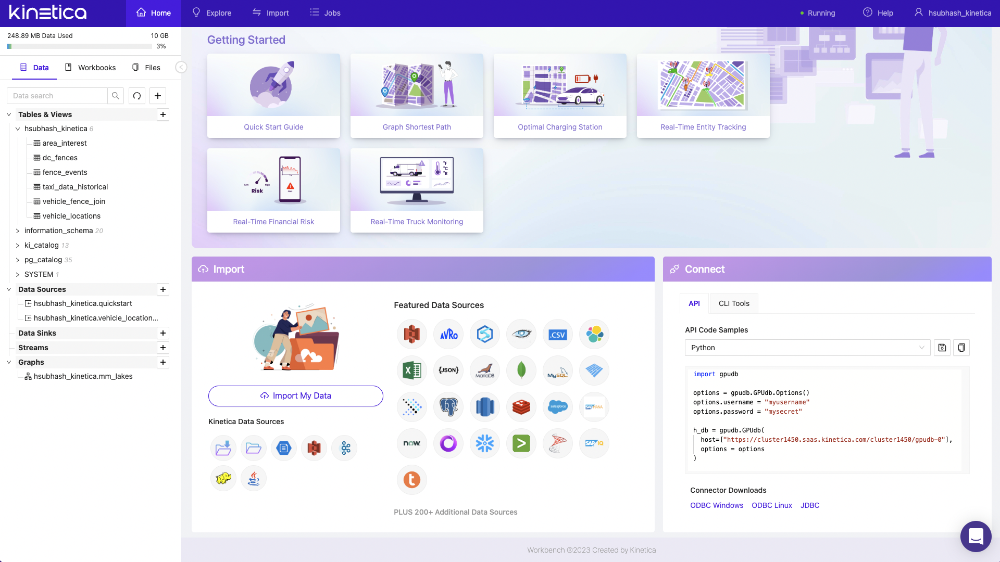
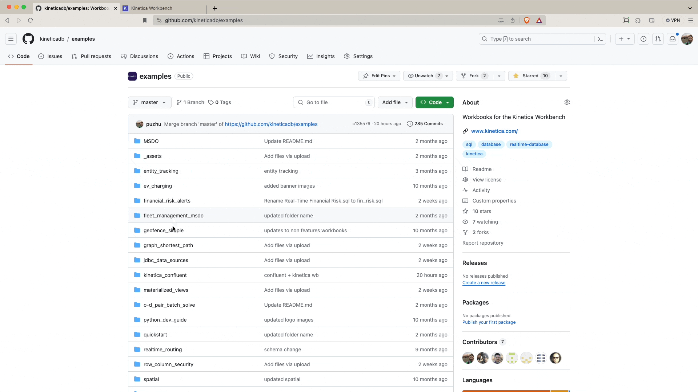

<h3 align="center">
    
</h3>
<h2 align="center">The database for time and space</h2>
<h3 align="center">
    <a href="https://www.kinetica.com/">Website</a>
     | 
    <a href="https://docs.kinetica.com/7.1/">Docs</a>
     | 
    <a href="https://docs.kinetica.com/7.1/api/">API Docs</a>
     | 
    <a href="https://join.slack.com/t/kinetica-community/shared_invite/zt-1bt9x3mvr-uMKrXlSDXfy3oU~sKi84qg">Community Slack</a>   
</h3>

Kinetica is a database, purpose built for real-time analytics at scale. It leverages vectorized memory-first architecture with kernels that have been custom built for over a decade to deliver blistering performance at scale on significantly less infrastructure than traditional data warehouses. Using a highly-distributed, lockless design, Kinetica enables simultaneous ingestion and analysis with integrated geospatial, graph, SQL, and AI/ML capabilities. With out of the box connectors for ingest and egress, native language bindings and a rich API ecosystem, developers can leverage the tools that they are comfortable and familiar with to build and deploy advanced analytical applications.

<h3 align="center">
</img>
</h3>

This project contains **fully reproducible examples** of using Kinetica. Most of the examples feature workbench, an interactive SQL notebook wtih built in features to import/export, explore and visualize your data. Workbench is available for free via [Kinetica cloud](https://cloud.kinetica.com/trynow/) and the [developer edition](https://www.kinetica.com/developer-edition/). You can also deploy it as a managed service on [Azure and AWS](https://www.kinetica.com/platform/cloud/).

<h3 align="center">
</img>
</h3>

# How to run these examples
Each folder in this repo contains a fully reproducible example that uses either SQL or other supported languages (Python, Java, Javascript etc.).

### SQL workbooks
A majority of the examples in this repo use interactive SQL workbooks. The easiest way to download a workbook (without the entire repo) is as follows. 
1. Access the raw file and then right click to save as a JSON file on your machine.
<h3 align="center">
    </img>
</h3>

2. Import the workbook to your instance of Kinetica using the plus icon on the workbooks tab.
<h3 align="center">
    </img>
</h3>

### Other languages

Kinetica provides [APIs](https://docs.kinetica.com/7.1/api/) across different languages (Python, JavaScript, Java etc.) that can be used to connect to and query a Kinetica database server using a third party client. The language specific instructions are included with each example.

# Install Kinetica
The easiest way to get started is with the free developer edition of Kinetica.

### [Install the free developer edition](https://www.kinetica.com/try/)
Kinetica offers a free developer edition that can be installed on Windows or Mac/Linux operating systems. Dev edition of Kinetica requires Docker with at least 8GB of RAM allocated. You can follow the instructions [here](https://www.kinetica.com/try/) to download and install the developer edition.

### [Launch Kinetica as a service on the cloud](https://www.kinetica.com/platform/cloud/)
There are free versions of Kinetica that can be provisioned as a managed service on Azure or AWS. You will have to pay a small fee for cloud infrastructure (to the cloud provider). Follow the instructions [here to provision Kinetica](https://www.kinetica.com/platform/cloud/) on the cloud.

### Install the on-premise version of Kinetica
You can also deploy an on-premise version of Kinetica. You can find more information on the different installation options [here](https://docs.kinetica.com/7.1/install/installation-options/). 

# Support
For bugs please submit an [issue on Github](https://github.com/kineticadb/examples/issues). Please reference the example that you are having an issue with in the title.

For support your can post on [stackoverflow](https://stackoverflow.com/questions/tagged/kinetica) under the kinetica tag or [Slack](https://join.slack.com/t/kinetica-community/shared_invite/zt-1bt9x3mvr-uMKrXlSDXfy3oU~sKi84qg).

# Contact Us
* Ask a question on slack: [Slack](https://join.slack.com/t/kinetica-community/shared_invite/zt-1bt9x3mvr-uMKrXlSDXfy3oU~sKi84qg)
* Follow on Github: [Follow @kineticadb](https://github.com/kineticadb)
* Email us: [support@kinetica.com](mailto:support@kinetica.com)
* Visit: [https://www.kinetica.com/contact/](https://www.kinetica.com/contact/)
