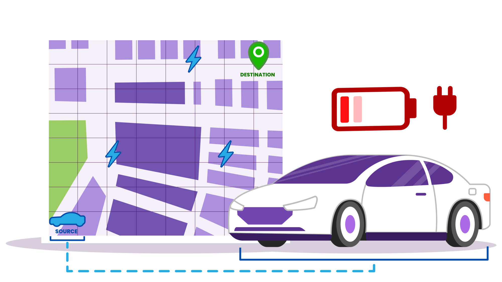

<h3 align="center" style="margin:0px">
    
</h3>
<h5 align="center" style="margin:0px">
    <a href="https://www.kinetica.com/">Website</a>
     | 
    <a href="https://docs.kinetica.com/7.2/">Docs</a>
     | 
    <a href="https://docs.kinetica.com/7.2/api/">API Docs</a>
     | 
    <a href="https://join.slack.com/t/kinetica-community/shared_invite/zt-1bt9x3mvr-uMKrXlSDXfy3oU~sKi84qg">Community Slack</a>   
</h5>

 </img>  </img>

<h1>
Finding optimal routes with an electric vehicle charging stop using Kinetica's graph API
</h1>
<h3 align="center" style="margin:0px">
    
</h3>

<h6 align="center">Demo Video 👇🏼</h6>
<h3 align="center">

</h3>

In this demo, we use Kinetica’s graph API to create a 1.2 million node graph representation of the road network in and around Detroit. We then use this graph network to find the optimal route between a source and destination point by picking the best charging station out of 268 different options. We repeat these computations every 5 seconds using a SQL procedure with new sets of source and destination points that are streaming in from a Kafka topic.
There are three steps in this analysis. 
1. Find the shortest path from source point to all the charging stations.
2. Compute the inverse shortest path from all the charging stations to the destination. 
3. Combine the two to find the optimal path with the lowest total cost.

The entire analysis is done with SQL on a small instance of Kinetica on Azure. We have set up all the data so that the example is fully reproducible. Follow the instructions below to try this out on your own.

### Try it yourself
All the steps and instructions are provided within the workbook itself. All you need to do is follow the instructions [here](https://github.com/kineticadb/examples#how-to-run-these-examples) to load the workbook into Kinetica and try this out on your own. 

Please follow the [Install Kinetica](https://github.com/kineticadb/examples#install-kinetica), if you don't have an instance of Kinetica available.

# Support
For bugs please submit an [issue on Github](https://github.com/kineticadb/examples/issues). Please reference the example that you are having an issue with in the title.

For support your can post on [stackoverflow](https://stackoverflow.com/questions/tagged/kinetica) under the kinetica tag or [Slack](https://join.slack.com/t/kinetica-community/shared_invite/zt-1bt9x3mvr-uMKrXlSDXfy3oU~sKi84qg).

# Contact Us
* Ask a question on slack: [Slack](https://join.slack.com/t/kinetica-community/shared_invite/zt-1bt9x3mvr-uMKrXlSDXfy3oU~sKi84qg)
* Follow on Github: <a class="github-button" href="https://github.com/kineticadb" data-size="large" aria-label="Follow @kineticadb on GitHub">Follow @kineticadb</a> 
* Email us: [support@kinetica.com](mailto:support@kinetica.com)
* Visit: [https://www.kinetica.com/contact/](https://www.kinetica.com/contact/)
