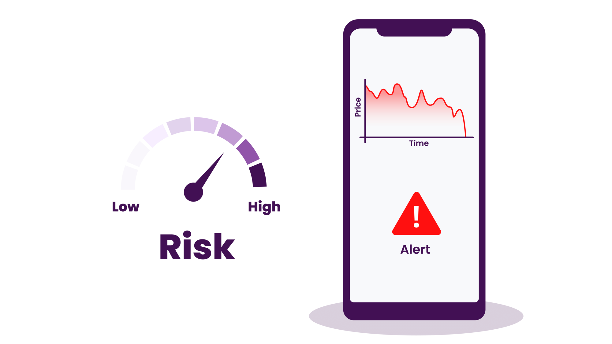

<h3 align="center" style="margin:0px">
    
</h3>
<h5 align="center" style="margin:0px">
    <a href="https://www.kinetica.com/">Website</a>
     | 
    <a href="https://docs.kinetica.com/7.2/">Docs</a>
     | 
    <a href="https://docs.kinetica.com/7.2/api/">API Docs</a>
     | 
    <a href="https://join.slack.com/t/kinetica-community/shared_invite/zt-1bt9x3mvr-uMKrXlSDXfy3oU~sKi84qg">Community Slack</a>   
</h5>

 </img>  </img>

<h1>
Real time financial risk alerting system
</h1>
<h3 align="center" style="margin:0px">
    
</h3>

<h6 align="center">Demo Video 👇🏼</h6>
<h3 align="center">

</h3>

This demo uses Kinetica to combine a real time stream of stock prices via a Kafka topic with information on porfolio holdings information from Amazon S3 to create alerts whenenver over portfolio values drop below a certain threshold.

## Background
Many of the world's storied investors are Hedge Funds. Unlike mutual funds, to which most people have access to, hedge funds cater to institutions and wealthy investors. Fortunately, four times a year, we get a peek into this secretive world by way of regulatory filings. Hedge funds holdings give us a unique view into their thinking c/o the bets they are making.

While holdings are published only quarterly, we have real-time information on the value of their known holdings -- so we can walk-forward the value of their holdings. This has traditionally been an academic curiosity, but with recent hedge fund blow-ups, this is now a practical exercise as well.
Finally, we see stark differences in viewpoints -- a number of very successful investors are bullish while others are highly bearish. We see the heated debates on Twitter -- but the below analysis shows how their actual holdings are playing out.

### Try it yourself
All the steps and instructions are provided within the workbook itself. All you need to do is follow the instructions [here](https://github.com/kineticadb/examples#how-to-run-these-examples) to load the workbook into Kinetica and try this out on your own. 

Please follow the [Install Kinetica](https://github.com/kineticadb/examples#install-kinetica), if you don't have an instance of Kinetica available.

# Support
For bugs please submit an [issue on Github](https://github.com/kineticadb/examples/issues). Please reference the example that you are having an issue with in the title.

For support your can post on [stackoverflow](https://stackoverflow.com/questions/tagged/kinetica) under the kinetica tag or [Slack](https://join.slack.com/t/kinetica-community/shared_invite/zt-1bt9x3mvr-uMKrXlSDXfy3oU~sKi84qg).

# Contact Us
* Ask a question on slack: [Slack](https://join.slack.com/t/kinetica-community/shared_invite/zt-1bt9x3mvr-uMKrXlSDXfy3oU~sKi84qg)
* Follow on Github: <a class="github-button" href="https://github.com/kineticadb" data-size="large" aria-label="Follow @kineticadb on GitHub">Follow @kineticadb</a> 
* Email us: [support@kinetica.com](mailto:support@kinetica.com)
* Visit: [https://www.kinetica.com/contact/](https://www.kinetica.com/contact/)
