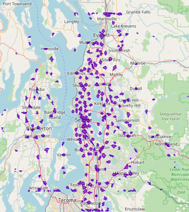
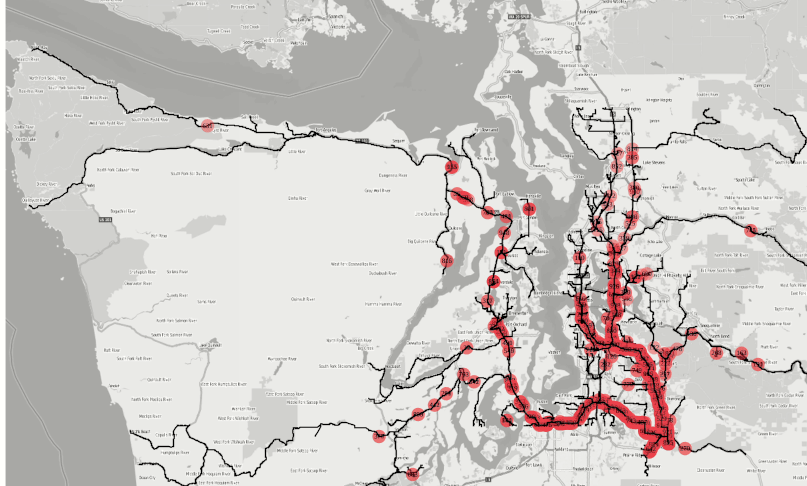

<h3 align="center" style="margin:0px">
    
</h3>
<h5 align="center" style="margin:0px">
    <a href="https://www.kinetica.com/">Website</a>
     | 
    <a href="https://docs.kinetica.com/7.2/">Docs</a>
     | 
    <a href="https://docs.kinetica.com/7.2/api/">API Docs</a>
     | 
    <a href="https://join.slack.com/t/kinetica-community/shared_invite/zt-1bt9x3mvr-uMKrXlSDXfy3oU~sKi84qg">Community Slack</a>   
</h5>

 </img>  </img>

<h1>
Analyzing Foursquare OS Places With Kinetica-Graph
</h1>

This workbook shows how Kinetica-Graph can be used to efficiently computes batch isochrones (travel time zones) over road networks using a single SQL statement. The key focus is on scalability and competitive coverage analysis for applications like fire station response times and business location optimization.

Instead of relying on geodesic distance, Kinetica-Graph's isochrone computation uses Dijkstra’s algorithm on road network topology, ensuring travel times reflect real-world routes and conditions. These computations can help businesses analyze customer reach and competitive overlap.

For real-world business use cases, the solver can invert graph directionality, finding which locations can reach a business within a given time rather than the other way around.

<h3 align="center" style="margin:0px">
    
</h3>

<h3 align="center" style="margin:0px">
    
</h3>

# Try it yourself
All the steps and instructions are provided within the workbook itself. All you need to do is follow the instructions [here](https://github.com/kineticadb/examples#how-to-run-these-examples) to load the workbook into Kinetica and try this out on your own. 

Please follow the [Install Kinetica](https://github.com/kineticadb/examples#install-kinetica) instructions, if you don't have an instance of Kinetica available.

# Support
For bugs please submit an [issue on Github](https://github.com/kineticadb/examples/issues). Please reference the example that you are having an issue with in the title.

For support your can post on [stackoverflow](https://stackoverflow.com/questions/tagged/kinetica) under the kinetica tag or [Slack](https://join.slack.com/t/kinetica-community/shared_invite/zt-1bt9x3mvr-uMKrXlSDXfy3oU~sKi84qg).

# Contact Us
* Ask a question on slack: [Slack](https://join.slack.com/t/kinetica-community/shared_invite/zt-1bt9x3mvr-uMKrXlSDXfy3oU~sKi84qg)
* Follow on Github: <a class="github-button" href="https://github.com/kineticadb" data-size="large" aria-label="Follow @kineticadb on GitHub">Follow @kineticadb</a> 
* Email us: [support@kinetica.com](mailto:support@kinetica.com)
* Visit: [https://www.kinetica.com/contact/](https://www.kinetica.com/contact/)
