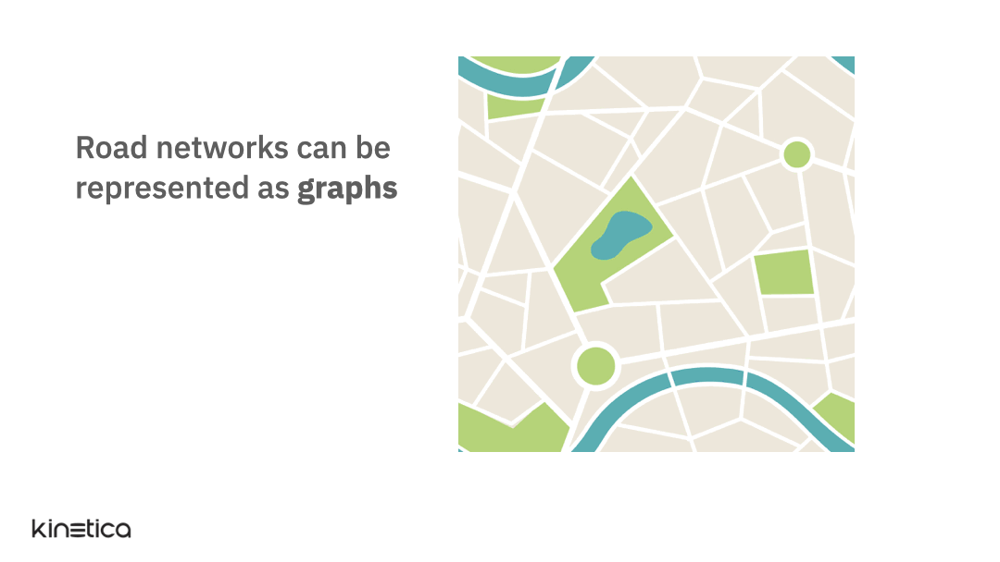
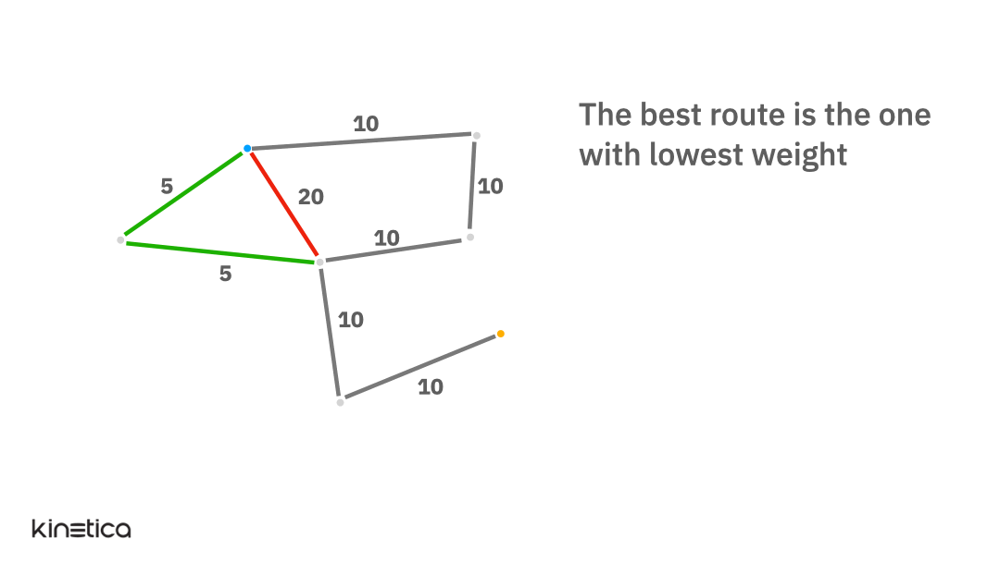
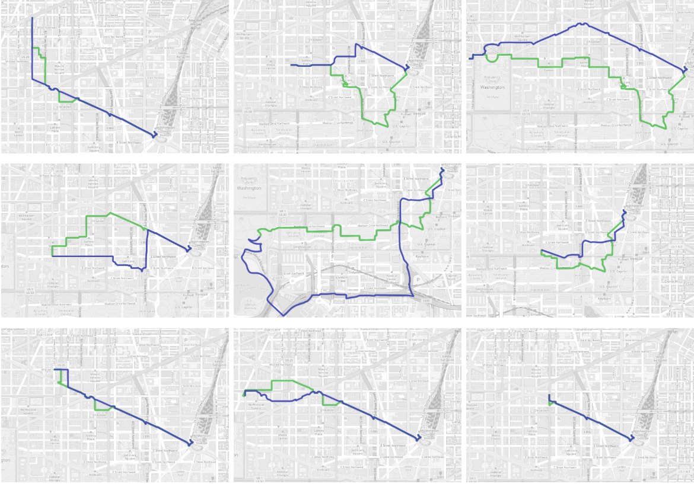

<h3 align="center" style="margin:0px">
    
</h3>
<h5 align="center" style="margin:0px">
    <a href="https://www.kinetica.com/">Website</a>
     | 
    <a href="https://docs.kinetica.com/7.2/">Docs</a>
     | 
    <a href="https://docs.kinetica.com/7.2/api/">API Docs</a>
     | 
    <a href="https://join.slack.com/t/kinetica-community/shared_invite/zt-1bt9x3mvr-uMKrXlSDXfy3oU~sKi84qg">Community Slack</a>   
</h5>

 </img>  </img>

<h1>
Real time routing using Graphs in Kinetica
</h1>

This workbook demonstrates how to account for real time live traffic data when computing optimal routes between two points. It shows the following capabilities.

1. Real time data feeds: Load and analyze real time traffic data
2. Convert road networks to graphs: Easily convert spatial data representing road networks into graphs in Kinetica
<h3 align="center" style="margin:0px">
    
</h3>
3. Apply weights at solve: We execute the graph solver once every 10 seconds with current traffic weights and compare with the same solver without the recent weights.
<h3 align="center" style="margin:0px">
    
</h3>

The maps below show a comparison between routes that had real time traffic weights applied to them vs. those that did not have any weights.
<h3 align="center" style="margin:0px">
    
</h3>

## Write once, do forever
All of the analsis in the workbook is done on real time data feeds that are continuously updated. Once set up, Kinetica will keep all the queries updated automatically.

## About the data
We have two static data sources and one streaming.

1. DC road network data: This is a CSV file on AWS S3 that contains spatial data (WKT linestrings) that describe roads in Washington DC along with additional information on the direction (one-way vs. two-way), distance and average time for traversing each segment.
2. Traffic weights data: This is a stream of fake traffic data associated with each edge in the DC road network that I have set up using Kafka. Each message in the Kafka topic consists of an edge ID that corresponds to the id in the DC road network data and an associated traffic weight. Note that this data is fake. I have generated it so as to show the effects of applying real time weights when solving a routing problem.
3. A list of source points: This CSV file on AWS S3 contains a set of starting points for each trip to Union Station. We select one point from this list at random when executing the solver. 

# Try it yourself
All the steps and instructions are provided within the workbook itself. All you need to do is follow the instructions [here](https://github.com/kineticadb/examples#how-to-run-these-examples) to load the workbook into Kinetica and try this out on your own. 

Please follow the [Install Kinetica](https://github.com/kineticadb/examples#install-kinetica) instructions, if you don't have an instance of Kinetica available.

# Support
For bugs please submit an [issue on Github](https://github.com/kineticadb/examples/issues). Please reference the example that you are having an issue with in the title.

For support your can post on [stackoverflow](https://stackoverflow.com/questions/tagged/kinetica) under the kinetica tag or [Slack](https://join.slack.com/t/kinetica-community/shared_invite/zt-1bt9x3mvr-uMKrXlSDXfy3oU~sKi84qg).

# Contact Us
* Ask a question on slack: [Slack](https://join.slack.com/t/kinetica-community/shared_invite/zt-1bt9x3mvr-uMKrXlSDXfy3oU~sKi84qg)
* Follow on Github: <a class="github-button" href="https://github.com/kineticadb" data-size="large" aria-label="Follow @kineticadb on GitHub">Follow @kineticadb</a> 
* Email us: [support@kinetica.com](mailto:support@kinetica.com)
* Visit: [https://www.kinetica.com/contact/](https://www.kinetica.com/contact/)
