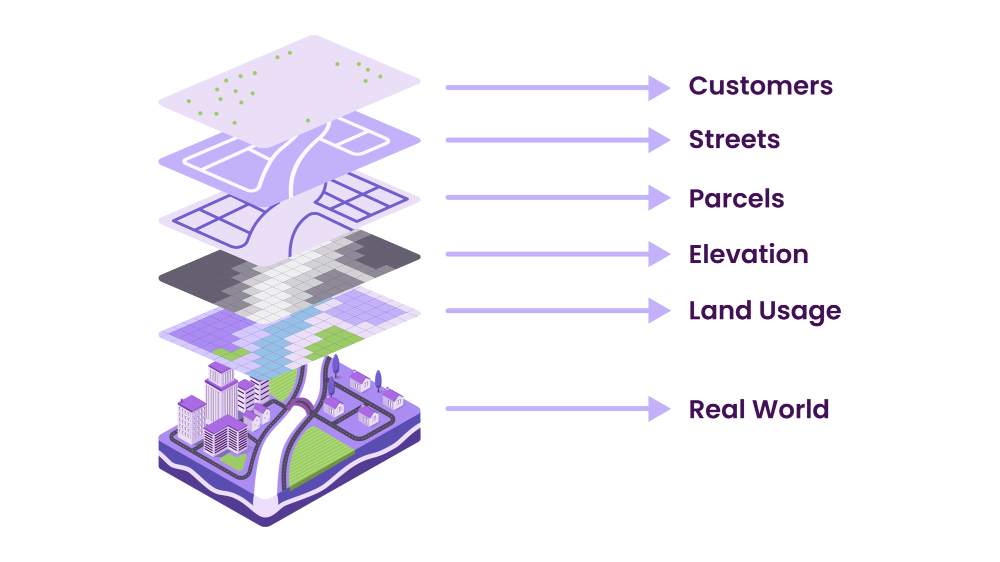
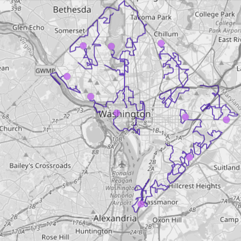
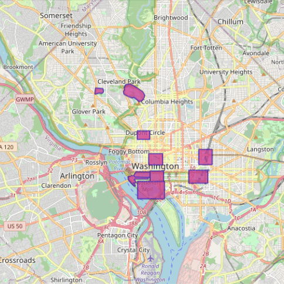
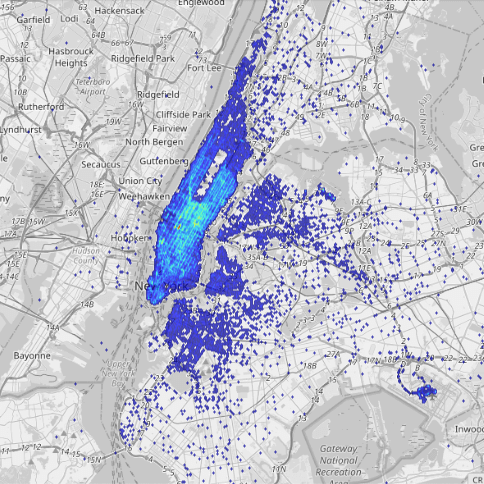

<head>

</head>
<h3 align="center" style="margin:0px">
    
</h3>
<h5 align="center" style="margin:0px">
    <a href="https://www.kinetica.com/">Website</a>
     | 
    <a href="https://docs.kinetica.com/7.1/">Docs</a>
     | 
    <a href="https://docs.kinetica.com/7.1/api/">API Docs</a>
     | 
    <a href="https://join.slack.com/t/kinetica-community/shared_invite/zt-1bt9x3mvr-uMKrXlSDXfy3oU~sKi84qg">Community Slack</a>   
</h5>

 </img>  </img>

<h1>
Real time spatial analytics with Kinetica
</h1>
<h3 align="center" style="margin:0px">
    
</h3>

This workbook demonstrates a wide range of spatial analytical capabilities, including:
1. Basic spatial operations for computing attributes like area, indentifying spatial relationship like intersections between spatial objects, and computing new geometries.
2. Spatial filtering
3. Spatial joins of data, where two tables are combined based on a spatial relationship
4. Geofencing. Identifying when a particular object enters a specific spatial 'fence'
5. Entity tracking: Tracks are unique to Kinetica and make it easy to analyze objects in motion.
6. Binning: Create spatial bins to aggregate data. We use the H3 index developed by Uber for this demonstration.

### About the data
We will use the following data for this demo.

1. A stream of GPS coordinates that record the movement of seven trucks in Washington, D.C. The data is being streamed in via a Kafka topic.
2. A set of polygons that outline different landmarks in D.C.
3. A stream of taxi trips that are occurring in New York City (a few hundred per second)

  

   <h3 align="center" style="margin:0px">
    
   </h3>
  

  

   <h3 align="center" style="margin:0px">
    
   </h3>
  

  

   <h3 align="center" style="margin:0px">
    
   </h3>
  

# Try it yourself
All the steps and instructions are provided within the workbook itself. All you need to do is follow the instructions [here](https://github.com/kineticadb/examples#how-to-run-these-examples) to load the workbook into Kinetica and try this out on your own. 

Please follow the [Install Kinetica](https://github.com/kineticadb/examples#install-kinetica) instructions, if you don't have an instance of Kinetica available.

# Support
For bugs please submit an [issue on Github](https://github.com/kineticadb/examples/issues). Please reference the example that you are having an issue with in the title.

For support your can post on [stackoverflow](https://stackoverflow.com/questions/tagged/kinetica) under the kinetica tag or [Slack](https://join.slack.com/t/kinetica-community/shared_invite/zt-1bt9x3mvr-uMKrXlSDXfy3oU~sKi84qg).

# Contact Us
* Ask a question on slack: [Slack](https://join.slack.com/t/kinetica-community/shared_invite/zt-1bt9x3mvr-uMKrXlSDXfy3oU~sKi84qg)
* Follow on Github: <a class="github-button" href="https://github.com/kineticadb" data-size="large" aria-label="Follow @kineticadb on GitHub">Follow @kineticadb</a> 
* Email us: [support@kinetica.com](mailto:support@kinetica.com)
* Visit: [https://www.kinetica.com/contact/](https://www.kinetica.com/contact/)
