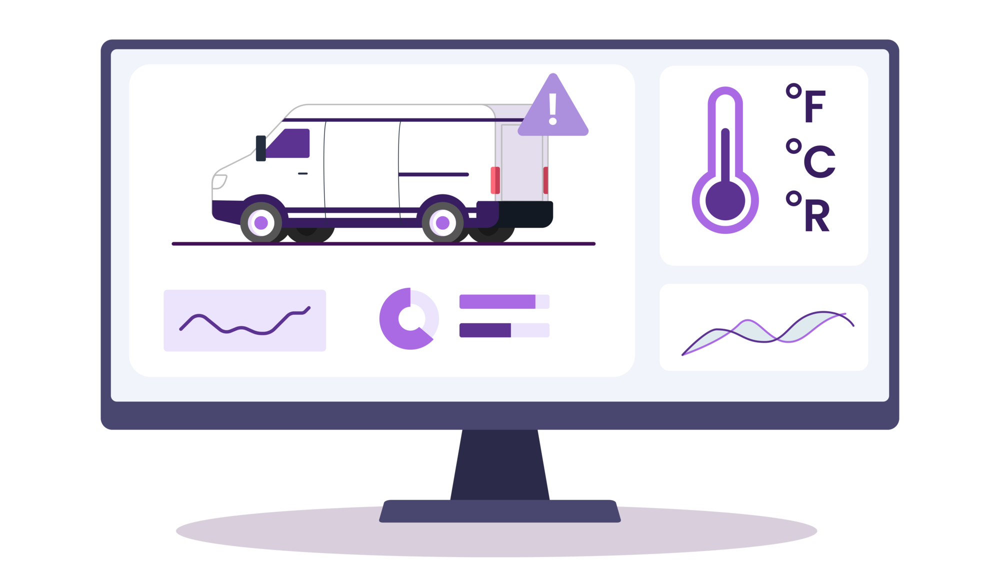

<h3 align="center" style="margin:0px">
    
</h3>
<h5 align="center" style="margin:0px">
    <a href="https://www.kinetica.com/">Website</a>
    <span> | </span>
    <a href="https://docs.kinetica.com/7.1/">Docs</a>
    <span> | </span>
    <a href="https://docs.kinetica.com/7.1/api/">API Docs</a>
    <span> | </span>
    <a href="https://join.slack.com/t/kinetica-community/shared_invite/zt-1bt9x3mvr-uMKrXlSDXfy3oU~sKi84qg">Community Slack</a>   
</h5>
<p align = "center">
 </img>  </img>
</p>
<h1>
Real time IoT monitoring system for transit trucks
</h1>
<h3 align="center" style="margin:0px">
    
</h3>

<h6 align="center">Demo Video 👇🏼</h6>
<h3 align="center">

[](https://www.youtube.com/watch?v=eA7YcRD1UVI)
</h3>

Interrupted or incorrect temperature control during transit is the cause of over one-third of the world’s food spoilage. This represents billions of dollars in losses every year.
<h3 align="center">
   </img>

</h3>

It is therefore important to monitor the conditions inside the truck at all times so that any shift from ideal storage conditions can be immediately flagged and corrected. But this is easier said than done.

A real time monitoring system for cold transit requires you to combine different streaming data sources that record things like GPS, pressure, temperature etc. 

But the challenge  is that this information is often coming from different sensors which record and send this information out at different points in time.  So combining them is not a straightforward task.

We solve this by performing an inexact ASOF join that is kept updated in real time using a materialized view. 

```sql
CREATE OR REPLACE MATERIALIZED VIEW transit_trucks.vehicle_analytics 
REFRESH EVERY 5 SECONDS AS 
SELECT
   vl.TRACKID AS vehicle_id,
   DATETIME(vm.ts) as DATETIME,
   vm.pressure 
FROM
   transit_trucks.vehicle_locations vl 
   INNER JOIN
      transit_trucks.vehicle_metrics vm 
      ON vl.TRACKID = vm.id 
      AND vl.TIMESTAMP = vm.ts
```
With just a single SQL statement we get an always on up to date view of cold storage metrics for different transit trucks. This view is then plugged into downstream alerting and decisioning systems.

### Try it yourself
All the steps and instructions are provided within the workbook itself. All you need to do is follow the instructions [here](https://github.com/kineticadb/examples#how-to-run-these-examples) to load the workbook into Kinetica and try this out on your own. 

Please follow the [Install Kinetica](https://github.com/kineticadb/examples#install-kinetica), if you don't have an instance of Kinetica available.

# Support
For bugs please submit an [issue on Github](https://github.com/kineticadb/examples/issues). Please reference the example that you are having an issue with in the title.

For support your can post on [stackoverflow](https://stackoverflow.com/questions/tagged/kinetica) under the kinetica tag or [Slack](https://join.slack.com/t/kinetica-community/shared_invite/zt-1bt9x3mvr-uMKrXlSDXfy3oU~sKi84qg).

# Contact Us
* Ask a question on slack: [Slack](https://join.slack.com/t/kinetica-community/shared_invite/zt-1bt9x3mvr-uMKrXlSDXfy3oU~sKi84qg)
* Follow on Github: <a class="github-button" href="https://github.com/kineticadb" data-size="large" aria-label="Follow @kineticadb on GitHub">Follow @kineticadb</a> 
* Email us: [support@kinetica.com](mailto:support@kinetica.com)
* Visit: [https://www.kinetica.com/contact/](https://www.kinetica.com/contact/)
